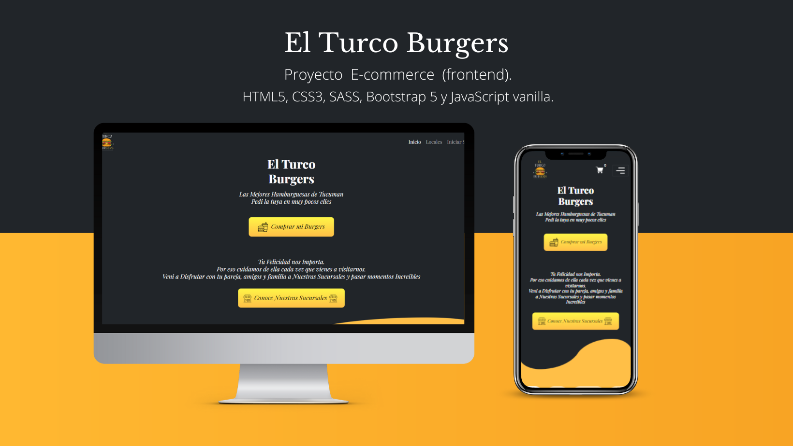

# El Turco Burgers E-commerce(Frontend)

## Introduccion

¿De qué trata?
Es un proyecto trabajado con el fin de dar a conocer mis conocimientos con **HTML5, CSS3, SASS, BOOTSTRAP, JAVASCRIPT** y algunas librerías y tecnologías complementarias. Su estructura es de fácil lectura ya que cada fragmento de código esta comentado con el fin de tener una mejor comprensión de lectura.
 
El proyecto trata de una hamburguesería que puede darle a sus clientes la posibilidad de comprar burgers desde su celular con pocos clics desde la web. Sin necesidad de contactar con la hamburguesa por alguna red social para saber si hay disponibilidad de algún producto y perder tiempo hasta que responde sus consultas.
 
Su construcción comienza por mobile first por lo tanto su diseño estará más adaptado a dispositivos pequeños y no tanto a desktop.
 
Este proyecto seguirá en desarrollo mientras vaya aprendiendo nuevas tecnologías en el camino.

## Stack Tecnologico 

### Lenguales
1. HTML5
2. CSS3
3. SASS
4. JAVASCRIPT 

### Framework
1. BOOTSTRAP 5.1.3

### Librerias
1. Data Aos >Para las Animaciones 
2. ToastifyJs >Para el mensaje Añadido al Carrito
3. Cleave.js >Para el formulario metodo de pago.

### Consumo de APIS 
Utilizo Fetch y un archivo local JSON